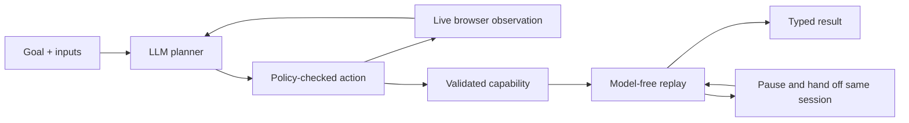

# Capability Lab

[](https://codespaces.new/namandiwan/capability-lab?quickstart=1)

A focused computer-use runtime for the interface.ai engineering assignment: discover a workflow through a live UI, record a typed capability, and replay it without a model.

The repository includes genuine LLM discovery from a free local Qwen3 model, deterministic replay of that learned artifact with new inputs, explicit exceptional outcomes, human handoff evidence, and an offline regression matrix. No paid API is required.

## What it does

LedgerDesk is a local, fictional banking application. The workflow searches for a member, opens their record, prepares a Savings sub-account draft, and stops at review. It returns the existing savings balance, selected product and review status. Creating an account is outside automation policy.

The app has an iframe, table-based forms and no test IDs. The automation interacts through accessible roles/names; it never calls a banking data API. This is one curated vendor adapter, not a general agent for arbitrary websites.



## Setup

### Fastest reviewer path (no local installation)

Open the repository in GitHub Codespaces. The included dev-container installs Node dependencies and Chromium inside the codespace. Then run:

```bash
npm run review
```

This type-checks the project, runs the browser suite, executes the offline scenario/stability matrix, and prints the agent-facing capability catalog. It does not regenerate the LLM discovery evidence because downloading a model on every review would waste time; the genuine run and its exact deterministic replays are committed under `evidence/`.

### Local setup

Use Node.js 22 or newer and npm. From the repository root:

```bash
npm ci
npx playwright install chromium
npm run build
npm test
```

`build` performs TypeScript checking; source runs through `tsx`. Alternatively, use an installed Google Chrome by setting `export BROWSER_CHANNEL=chrome`. On Linux, Playwright may require `npx playwright install --with-deps chromium`.

## Offline demo: no API key

```bash
DEMO_OUT="runs/offline-$(date +%s)" npm run demo
```

This starts its own local server and runs the hand-authored fixture against actual browser sessions. It covers normal replay, a second member, not-found, validation, permission denial, slow loading, a known notice, session restoration with a simulated operator, an application error, and five repeat runs. The expected application-error result is a failure requiring an operator; it is not an unexpected demo crash. Always use a fresh output directory to avoid mixing runs.

To explore the app manually:

```bash
npm run sandbox
```

Open http://127.0.0.1:4173/ and use fictional member `10001` or `10002`. Keep this terminal running for the following commands.

## Genuine discovery with a free local model

Install [Ollama](https://ollama.com/) and download the approximately 2.5 GB Qwen3 4B model once. No account, API key, billing, or network call during inference is required:

```bash
brew install ollama
brew services start ollama
ollama pull qwen3:4b
npm run discover:local
```

The model receives the current public UI state, allowed actions, goal and successful action history. It chooses one structured action per turn. Policy remains authoritative. The successful included run used `ollama/qwen3:4b`, made eight model decisions, and wrote a versioned artifact. To replay the latest successful discovery with new inputs and a not-found case:

```bash
npm run verify:discovered
```

Each run uses a fresh timestamped directory, preserving unsuccessful attempts. A successful discovery writes `capability.json`, `events.jsonl` and `result.json`, and updates the non-sensitive pointer `evidence/latest-discovery.json`. Merely changing artifact provenance is not evidence.

An optional OpenAI adapter is retained for comparison. Set `MODEL_PROVIDER=openai` and configure `OPENAI_API_KEY`; this path may cost money and is not needed for the included demonstration. Goals should refer to parameter names, not embed credentials or personal data.

## Replay the discovered capability with new inputs

For an individual headed replay, start `npm run sandbox` and use the artifact path from `evidence/latest-discovery.json`:

```bash
npm run replay -- \
  --artifact evidence/discovery-1789097619829/capability.json \
  --member 10002 \
  --nickname "Emergency savings" \
  --headed \
  --out evidence/replay

npm run replay -- \
  --artifact evidence/discovery-1789097619829/capability.json \
  --member 99999 \
  --out evidence/replay-not-found
```

No API key is required for replay. Verify `modelCalls: 0`, a successful first result, and a `business_outcome` with `not_found` for the second. Financial outputs appear in the caller's stdout but are redacted in stored result files. Protect stdout if using sensitive data outside this synthetic demo.

## Human handoff

```bash
npm run replay -- \
  --artifact evidence/discovery-1789097619829/capability.json \
  --scenario expired --headed --operator \
  --out evidence/manual-handoff
```

The run pauses on session expiry. In the browser it already opened, click **Restore session**. Return to the terminal and type `resume`. The engine checks the expected state before continuing. Any other answer aborts. The operator wait is bounded (normally 60 seconds, also subject to the run budget).

For an offline rehearsal, replace the artifact path with `evidence/offline/capability.json`. The existing automated handoff evidence uses a simulated operator, clearly labeled as such.

## Capability and result contracts

- `src/schema.ts`: authoritative runtime schemas, parameter references and state continuity validation.
- `docs/contracts/`: exported input/output schemas and reviewed locator binding.
- `src/profile.ts`: exact role/name targets, state markers, and permitted action combinations.
- `src/runtime.ts`: discovery/replay, bounded waits, outcomes and checkpoints.
- `src/surface.ts`: browser adapter and `Surface` extension seam.
- `src/handoff.ts`: ownership transfer and terminal operator.

A result is `success` with typed outputs, `business_outcome` with a known code, or `failure` with step, expected/observed state and code. Raw browser/model error messages are suppressed; diagnostics intentionally trade detail for data minimization.

The registry exposes saved artifacts as function-style capabilities with JSON Schema arguments/results:

```bash
npm run catalog
```

An agent or reviewer can invoke the discovered capability by name with typed arguments:

```bash
npm run invoke -- \
  --name prepare-subaccount-review \
  --member 10002 \
  --nickname "Emergency savings" \
  --out runs/named-invocation
```

The registry resolves the reviewed artifact, validates arguments and dispatches the same model-free replay runtime.

## Evidence and limitations

See `evidence/README.md` for evidence provenance and `docs/SUBMISSION-CHECKLIST.md` for remaining work. See `REPORT.md` for the seven required design sections.

Existing tests cover parameterized replay, business outcomes, notice/slow-load recovery, same-session handoff, bad resume, failure snapshots, forbidden artifacts, ambiguity, schemas, privacy, provider schemas, the local-model adapter and test-double discovery. Genuine local-model evidence establishes one successful run, not production reliability or support for arbitrary desktop/legacy applications.

The app and all records are synthetic. No actual financial institution is accessed. AI assistance was used in development; the submitter should run, understand and be able to defend the implementation.
